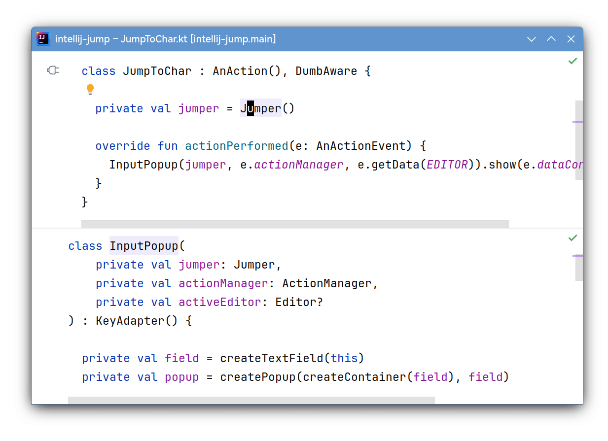

# Jump

Jump to any visible location of any visible editor quickly, using the keyboard.

This package provides a single action **Jump to Char**, when invoked,
it will ask you to enter the character you want to jump to, then all these
characters in all editors in all windows will be replaced by quick key overlays,
to go to one, type the overlay keys.

The following demostrates jumping between 3 locations: **J<ins>u</ins>mper**,
**action<ins>P</ins>erformed**, and **<ins>I</ins>nputPopup**:

## Configuration

There is no default keyboard shortcut assigned to the **Jump to Char** action,
to assign one, go to `Settings | Keymap | Plugins | Jump | Jump to Char`.

## Build

To build the plugin locally, run `./gradlew clean build`, then
build/distributions/intellij-jump-xxx.zip will be created.
It can be installed by going to the IntelliJ's plugins settings,
and choose install from disk.
